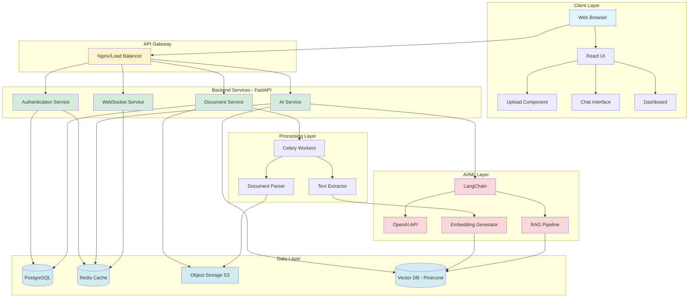
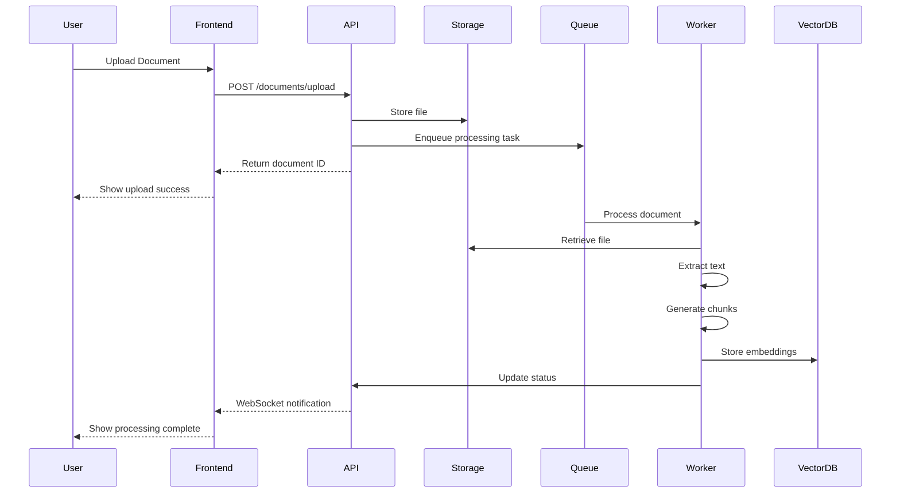
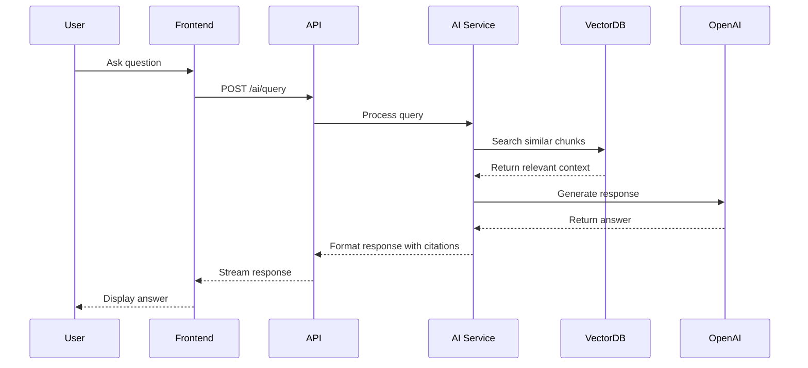

# High-Level Architecture
## AI-Powered Document Analyzer

## Overview
The AI-Powered Document Analyzer is a full-stack application that enables users to upload documents in various formats, extract insights, and interact with document content through an AI-powered Q&A interface.

## Architecture Diagram

## System Components

### 1. Client Layer
**Technology**: React + TypeScript + Vite

- **Web Browser**: Primary user interface
- **React UI**: Single-page application with responsive design
- **Upload Component**: Drag-and-drop file upload with preview
- **Chat Interface**: Real-time Q&A with documents
- **Dashboard**: Analytics and insights visualization

### 2. API Gateway Layer
**Technology**: Nginx or Cloud Load Balancer

- Routes requests to appropriate backend services
- SSL/TLS termination
- Rate limiting
- CORS handling
- Static file serving

### 3. Backend Services Layer
**Technology**: FastAPI (Python)

#### Authentication Service
- User registration and login
- JWT token generation and validation
- OAuth2 integration
- Session management
- Role-based access control (RBAC)

#### Document Service
- File upload handling
- Document metadata management
- Format validation
- Storage coordination
- Document retrieval and deletion

#### AI Service
- Query processing
- Embedding generation
- Semantic search
- Response generation
- Conversation context management

#### WebSocket Service
- Real-time chat communication
- Progress notifications
- Live updates
- Connection management

### 4. Processing Layer
**Technology**: Celery + Redis

#### Document Parser
- PDF processing (PyPDF2, pdfplumber)
- Word document parsing (python-docx)
- Excel parsing (openpyxl)
- Image OCR (Tesseract, pytesseract)
- Text extraction and cleaning

#### Text Extractor
- Content chunking
- Metadata extraction
- Language detection
- Format standardization

#### Celery Workers
- Asynchronous task processing
- Background job execution
- Retry mechanisms
- Task scheduling

### 5. AI/ML Layer
**Technology**: OpenAI API + LangChain

#### OpenAI API
- GPT-4 for Q&A and analysis
- text-embedding-3-large for embeddings
- Function calling for structured outputs

#### Embedding Generator
- Document vectorization
- Query embedding
- Similarity computation

#### RAG Pipeline
- Context retrieval from vector store
- Prompt engineering
- Response generation with citations

#### LangChain
- Document loaders
- Text splitters
- Chain orchestration
- Memory management
- Agent framework

### 6. Data Layer

#### PostgreSQL
**Purpose**: Primary relational database
- User accounts and profiles
- Document metadata
- Conversation history
- Analytics data
- Access control lists

#### Redis Cache
**Purpose**: High-speed caching and message broker
- Session storage
- API rate limiting
- Celery task queue
- Real-time data caching
- WebSocket state management

#### Object Storage (S3/Azure Blob)
**Purpose**: Document file storage
- Original uploaded files
- Processed document versions
- Exported reports
- Static assets

#### Vector Database (Pinecone)
**Purpose**: Semantic search and embeddings
- Document embeddings
- Chunk embeddings
- Semantic similarity search
- Fast vector retrieval

## Data Flow

### Document Upload Flow

### Q&A Flow

## Security Architecture

### Authentication & Authorization
- JWT-based authentication
- OAuth2 password flow
- Refresh token rotation
- Role-based access control (RBAC)
- API key management for external integrations

### Data Security
- Encryption at rest (AES-256)
- Encryption in transit (TLS 1.3)
- Secure file upload validation
- Content Security Policy (CSP)
- XSS and CSRF protection

### API Security
- Rate limiting per user/IP
- Request validation and sanitization
- API versioning
- Audit logging
- DDoS protection

## Scalability Considerations

### Horizontal Scaling
- Stateless API design
- Load balancer distribution
- Multiple worker instances
- Database read replicas

### Vertical Scaling
- Resource optimization
- Caching strategies
- Connection pooling
- Query optimization

### Performance Optimization
- CDN for static assets
- Redis caching layer
- Lazy loading in frontend
- Pagination and infinite scroll
- Async processing for heavy tasks

## Monitoring & Observability

### Logging
- Application logs (structured JSON)
- Access logs
- Error tracking
- Audit trails

### Metrics
- API response times
- Request rates
- Error rates
- System resource usage
- Queue lengths

### Alerting
- Error rate thresholds
- Performance degradation
- System resource limits
- Security events

## Deployment Architecture

### Development Environment
- Docker Compose for local development
- Hot reload for frontend and backend
- Local PostgreSQL, Redis, MinIO

### Production Environment
- Container orchestration (Docker/Kubernetes)
- Managed database services (AWS RDS, Azure PostgreSQL)
- Managed cache (AWS ElastiCache, Azure Redis)
- Cloud object storage (S3, Azure Blob)
- Managed vector database (Pinecone)
- CI/CD pipeline (GitHub Actions)

## Technology Decisions Rationale

| Component | Technology | Reasoning |
|-----------|------------|-----------|
| Frontend | React + TypeScript | Type safety, component reusability, large ecosystem |
| Backend | FastAPI | High performance, async support, auto-generated docs |
| Database | PostgreSQL | ACID compliance, JSON support, reliability |
| Cache | Redis | Speed, pub/sub support, data structures |
| Queue | Celery + Redis | Python integration, reliability, monitoring |
| AI | OpenAI + LangChain | State-of-the-art models, easy integration, RAG support |
| Vector DB | Pinecone | Managed service, scalability, performance |
| Storage | S3/Azure Blob | Scalability, durability, cost-effective |

## Future Enhancements

1. **Multi-tenancy**: Organization-level document isolation
2. **Advanced Analytics**: ML-based insights and trends
3. **Collaboration**: Real-time document collaboration
4. **Mobile App**: Native iOS/Android applications
5. **API Marketplace**: Third-party integrations
6. **Custom Models**: Fine-tuned models for specific domains
7. **Multi-language Support**: I18n for global users
8. **Advanced Search**: Filters, facets, and advanced queries
