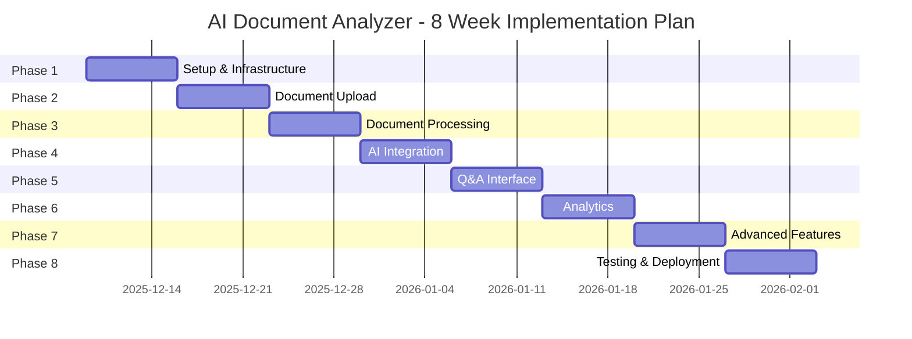

# Implementation Plan
## AI-Powered Document Analyzer

## Project Timeline Overview



---

## Phase 1: Project Setup & Core Infrastructure
**Duration**: Week 1 (Dec 9-15, 2025)  
**Goal**: Establish development environment and authentication system

### Tasks

#### 1.1 Project Structure Setup
- [x] Create monorepo structure
  ```
  project-root/
  ├── frontend/          # React application
  ├── backend/           # FastAPI application
  ├── docker/            # Docker configurations
  ├── docs/              # Documentation
  └── scripts/           # Utility scripts
  ```
- [x] Initialize Git repository
- [x] Set up .gitignore files
- ~~Create README.md with setup instructions~~ (Will be completed at end of project)

#### 1.2 Frontend Setup
- [x] Initialize Vite + React + TypeScript project
- [x] Install core dependencies
  - React Router
  - Tailwind CSS + shadcn/ui
  - Zustand for state management
  - TanStack Query
  - Axios
- [x] Configure Tailwind CSS
- [x] Set up folder structure
  ```
  frontend/src/
  ├── components/        # Reusable components
  ├── pages/             # Page components
  ├── hooks/             # Custom hooks
  ├── services/          # API services
  ├── store/             # State management
  ├── types/             # TypeScript types
  └── utils/             # Utilities
  ```
- [x] Create base layout component
- [x] Set up routing structure

#### 1.3 Backend Setup
- [x] Initialize FastAPI project
- [x] Set up virtual environment
- [x] Install core dependencies
  - FastAPI, Uvicorn
  - SQLAlchemy, Alembic
  - Pydantic Settings
  - python-jose, passlib
- [x] Create folder structure
  ```
  backend/
  ├── app/
  │   ├── api/           # API routes
  │   ├── core/          # Core configurations
  │   ├── models/        # Database models
  │   ├── schemas/       # Pydantic schemas
  │   ├── services/      # Business logic
  │   └── utils/         # Utilities
  ├── alembic/           # Migrations
  ├── tests/             # Test files
  └── requirements.txt
  ```
- [x] Configure environment variables (.env)
- [x] Set up logging configuration

#### 1.4 Database & Docker Setup
- [x] Create docker-compose.yml
  - PostgreSQL service
  - Redis service
  - Backend service (running locally)
  - Frontend service (dev, running locally)
- [x] Configure PostgreSQL connection
- [x] Set up Alembic for migrations
- [x] Create initial database models (User, Document)
  - User model created ✓
  - Document model created ✓
- [x] Run initial migration

#### 1.5 Authentication System
- [x] Create User model and schema
- [x] Implement JWT token generation
- [x] Build registration endpoint
- [x] Build login endpoint
- [x] Implement token refresh mechanism
  - Refresh token generation (7-day expiry)
  - POST /auth/refresh endpoint
  - Automatic token refresh on 401 errors
- [x] Add password hashing with bcrypt
- [x] Create authentication middleware
- [x] Build protected route decorator

#### 1.6 Frontend Auth Integration
- [x] Create auth store (Zustand)
- [x] Build login page UI
- [x] Build registration page UI
- [x] Implement auth service functions
- [x] Add JWT token storage (localStorage)
- [x] Create protected route component
- [x] Add axios interceptors for auth headers

### Deliverables/refresh)
- ✅ Database with migrations (User & Document models)
- ✅ Modern frontend with routing and UI enhancements
- ✅ Comprehensive logging (backend & frontend)
- ✅ Token refresh mechanism with 7-day sessions

### Success Criteria
- ✅ User can register a new account
- ✅ User can log in and receive JWT tokens (access + refresh)
- ✅ Protected routes require authentication
- ✅ Tokens automatically refresh on expiration
- ✅ Docker services start without errors
- ✅ All API requests and auth events are logged

### 🎉 Phase 1 Status: **COMPLETE** (Dec 21, 2025)
- User can log in and receive JWT token
- Protected routes require authentication
- Docker services start without errors

---

## Phase 2: Document Upload & Storage
**Duration**: Week 2 (Dec 16-22, 2025)  
**Goal**: Implement file upload system with multi-format support

### Tasks

#### 2.1 Backend - Storage Configuration
- [x] Set up S3/MinIO connection (AWS S3 configured)
- [x] Create storage service abstraction (S3 + local filesystem support)
- [x] Implement file upload to object storage
- [x] Add file size validation (10MB limit)
- [x] Create file type validation (PDF, DOCX, XLSX, TXT, PNG, JPG, JPEG)
- [x] Generate unique file identifiers (user_id/timestamp_uuid_filename)
- [x] Implement file deletion functionality (S3 + database)

#### 2.2 Backend - Document API
- [x] Create Document model
  - id, user_id, filename, file_path, file_type
  - file_size, upload_date, status, metadata
- [x] Create document schemas (Pydantic)
- [x] Build POST /api/v1/documents/upload endpoint
- [x] Build GET /api/v1/documents/ endpoint (list with pagination)
- [x] Build GET /api/v1/documents/{id} endpoint
- [x] Build DELETE /api/v1/documents/{id} endpoint
- [x] Add pagination for document list (page, page_size, total_pages)
- [x] Implement file download endpoint (GET /api/v1/documents/download/{id})
- [x] **BONUS**: Build GET /api/v1/documents/stats/overview endpoint

#### 2.3 Frontend - Upload UI
- [x] Create upload page component (integrated in HomePage)
- [x] Integrate react-dropzone
- [x] Build drag-and-drop zone
- [x] Add file type icons (PDF, Word, Excel, Images)
- [x] Show upload progress bar (per-file tracking)
- [x] Display file validation errors
- [ ] Create file preview component (deferred to Phase 7)
- [x] Add multi-file upload support ✨

#### 2.4 Frontend - Document Management
- [x] Create documents list page (DocumentsPage with gallery view)
- [x] Build document card component
- [x] Add document metadata display (size, date, status)
- [x] Implement delete confirmation modal
- [x] Add search/filter functionality (filter by status)
- [ ] Create document detail view (deferred - have gallery view)
- [x] Add loading states and skeletons

#### 2.5 Virus Scanning (Optional)
- [ ] Integrate ClamAV or similar (deferred to future)
- [ ] Add virus scan before storage
- [ ] Handle infected files

### Deliverables
- ✅ Working file upload system (multi-file support)
- ✅ Document storage in S3
- ✅ Document list and gallery views with filters
- ✅ File validation and error handling
- ✅ Real-time stats dashboard

### Success Criteria
- ✅ User can upload PDF, DOCX, XLSX, TXT, PNG, JPG files
- ✅ Multiple files can be uploaded at once
- ✅ Files are stored securely in S3
- ✅ User can view list of uploaded documents with pagination
- ✅ User can filter documents by status
- ✅ User can delete their documents
- ✅ File size limits (10MB) are enforced
- ✅ File type validation works correctly
- ✅ Upload progress is tracked per file
- ✅ Dashboard shows real-time statistics

### 🎉 Phase 2 Status: **COMPLETE** (Dec 22, 2025)
- Multi-file upload with drag-and-drop working
- Document gallery with status filters functional
- S3 storage integration tested and verified
- All core requirements met, bonus features added

---

## Phase 3: Document Processing & Extraction
**Duration**: Week 3 (Dec 23-29, 2025)  
**Goal**: Extract text content from various document formats

### Tasks

#### 3.1 Celery Setup
- [x] Install Celery and Redis
- [x] Configure Celery worker (start_worker.py)
- [x] Set up task routing ("celery" queue)
- [x] Create base task classes
- [x] Add task retry logic
- [x] Set up worker with solo pool (Windows compatibility)

#### 3.2 Document Parsers
- [x] Create PDF text extractor (PyPDF2 + pdfplumber)
- [x] Create Word document parser (python-docx)
- [x] Create Excel parser (openpyxl)
- [x] Create image OCR (pytesseract)
- [x] Implement text cleaning utilities
- [x] Add language detection (langdetect)
- [x] Handle parsing errors gracefully

#### 3.3 Text Processing
- [x] Implement text chunking strategy
  - Chunk size: ~2000 characters
  - Overlap: 200 characters
- [x] Create metadata extraction (page count, word count, language)
- [x] Add text normalization
- [x] Implement DocumentChunk model with metadata

#### 3.4 Async Processing Pipeline
- [x] Create document processing task (process_document_task)
- [x] Add task status tracking (PROCESSING, COMPLETED, FAILED)
- [x] Store extracted text in database
- [x] Create DocumentChunk model with indexes
- [x] Update document status on completion
- [x] Implement error handling and logging

#### 3.5 Frontend - Processing Status
- [x] Add processing status indicator (status badges)
- [x] Create processing action buttons (Process/Retry)
- [x] Display error messages for failed documents
- [x] Show processing errors with retry functionality
- [x] Real-time status updates without refresh

#### 3.6 WebSocket Integration
- [x] Set up WebSocket endpoint (/ws)
- [x] Implement real-time status updates via Redis pub/sub
- [x] Create frontend WebSocket client (useWebSocket hook)
- [x] Handle connection lifecycle (connect/disconnect/reconnect)
- [x] Add automatic reconnection logic (exponential backoff)
- [x] Integrate WebSocket with document processing updates

### Deliverables
- ✅ Multi-format document parsing (5 file types)
- ✅ Asynchronous processing with Celery
- ✅ Text extraction and chunking
- ✅ Real-time processing updates via WebSocket
- ✅ Error handling with retry functionality

### Success Criteria
- ✅ PDFs are parsed and text extracted
- ✅ Word and Excel files are processed
- ✅ Images with OCR support (with Tesseract)
- ✅ Text is chunked into ~2000 character pieces with overlap
- ✅ User receives real-time processing updates
- ✅ Processing errors are logged and displayed
- ✅ Failed documents can be retried

### 🎉 Phase 3 Status: **COMPLETE** (Dec 23, 2025)
- Successfully processing PDF, Word, Excel, Text, and Image files
- Real-time WebSocket updates working via Redis pub/sub
- Error messages and retry functionality operational
- 285 words extracted from test PDF, 1 chunk created
- Language detection working (English detected)

---

## Phase 4: AI Integration & Embeddings
**Duration**: Week 4 (Dec 30, 2025 - Jan 5, 2026)  
**Goal**: Integrate AI capabilities for semantic search using multi-provider architecture

### Architecture Overview
- **LLM Framework**: LangChain (provider abstraction)
- **Primary Provider**: Azure OpenAI (enterprise-grade)
- **Vector Database**: PostgreSQL with pgvector extension
- **Design Pattern**: Factory pattern for provider switching

### Tasks

#### 4.1 Azure OpenAI Setup
- [ ] Create Azure OpenAI resource in Azure Portal
- [ ] Deploy embedding model (text-embedding-3-small)
- [ ] Deploy chat model (gpt-4o-mini)
- [ ] Configure API keys and endpoints in .env
- [ ] Set up rate limiting and error handling
- [ ] Add cost tracking configuration (optional)

#### 4.2 LangChain Service Layer
- [ ] Install LangChain packages (langchain, langchain-openai, langchain-community)
- [ ] Create service layer structure (app/services/llm/)
- [ ] Implement base abstract interfaces (BaseLLMProvider)
- [ ] Build Azure OpenAI provider implementation
- [ ] Create provider factory pattern
- [ ] Add LLM configuration management

#### 4.3 PostgreSQL Vector Database Setup
- [ ] Install pgvector extension in PostgreSQL Docker
- [ ] Add pgvector Python package to requirements.txt
- [ ] Update DocumentChunk model with embedding vector column
- [ ] Create Alembic migration for vector support
- [ ] Add vector similarity indices (IVFFlat for cosine similarity)
- [ ] Test vector operations

#### 4.4 Embedding Service
- [ ] Create embedding service using LangChain Azure provider
- [ ] Implement single text embedding generation
- [ ] Add batch embedding generation (100 texts at a time)
- [ ] Create embedding storage in DocumentChunk.embedding column
- [ ] Add embedding metadata tracking
- [ ] Implement retry logic for API failures

#### 4.5 Indexing Pipeline
- [ ] Create generate_embeddings_task in Celery
- [ ] Trigger embedding generation after document processing
- [ ] Generate embeddings for all document chunks
- [ ] Store vectors in PostgreSQL with pgvector
- [ ] Add indexing status tracking (INDEXED status)
- [ ] Implement batch re-indexing for existing documents
- [ ] Handle indexing failures with retry logic
- [ ] Broadcast indexing status via WebSocket

#### 4.6 Semantic Search
- [ ] Create search service with pgvector queries
- [ ] Implement query embedding generation
- [ ] Build vector similarity search (cosine similarity)
- [ ] Add relevance scoring and ranking (top-k results)
- [ ] Filter by user_id for security
- [ ] Create search endpoint: POST /api/v1/search
- [ ] Create search result schemas
- [ ] Add search history tracking (optional)

#### 4.7 RAG Implementation
- [ ] Set up LangChain RAG chain
- [ ] Implement context retrieval from pgvector
- [ ] Build prompt templates for Q&A
- [ ] Create RAG service with Azure OpenAI chat model
- [ ] Add source attribution (document and chunk citations)
- [ ] Implement conversation context management
- [ ] Add confidence scoring
- [ ] Prepare for streaming responses (Phase 5)

#### 4.8 Testing & Validation
- [ ] Test embedding generation with sample documents
- [ ] Verify vector storage and retrieval
- [ ] Test semantic search with various queries
- [ ] Validate RAG responses for accuracy
- [ ] Test with different document types
- [ ] Measure response times (<3 seconds)
- [ ] Check cost per query

### Deliverables
- ✅ Multi-provider LLM service layer with Azure OpenAI
- ✅ Vector embeddings stored in PostgreSQL (pgvector)
- ✅ Semantic search endpoint functional
- ✅ RAG pipeline generating accurate responses
- ✅ Automatic embedding generation after document processing
- ✅ Search API with relevance ranking

### Success Criteria
- Documents are automatically indexed with embeddings after processing
- Semantic search returns relevant chunks (top 5-10 results)
- Vector similarity search uses cosine distance
- RAG pipeline generates accurate answers with proper context
- Sources are properly cited with document and chunk references
- Search/RAG responses are fast (<3 seconds)
- Provider can be switched via configuration
- All API calls logged and monitored
- Embedding costs are tracked and reasonable (<$1 per 1000 documents)

---

## Phase 5: Q&A Interface & Chat
**Duration**: Week 5 (Jan 6-12, 2026)  
**Goal**: Build interactive chat interface for document Q&A

### Tasks

#### 5.1 Backend - Chat API
- [ ] Create Conversation model
- [ ] Create Message model
- [ ] Build POST /api/chat/query endpoint
- [ ] Implement streaming response
- [ ] Add conversation history management
- [ ] Create context window management
- [ ] Implement multi-document querying

#### 5.2 Chat Service
- [ ] Create chat service class
- [ ] Implement query processing
- [ ] Add conversation context
- [ ] Build response generation
- [ ] Implement citation extraction
- [ ] Add confidence scoring

#### 5.3 Frontend - Chat UI
- [ ] Create chat page component
- [ ] Build message list component
- [ ] Create message input component
- [ ] Add typing indicator
- [ ] Implement auto-scroll
- [ ] Display citations inline
- [ ] Add copy message functionality

#### 5.4 Real-time Chat
- [ ] Set up Socket.io server
- [ ] Create chat WebSocket handlers
- [ ] Implement message streaming
- [ ] Add typing indicators
- [ ] Handle connection drops
- [ ] Implement message queue

#### 5.5 Conversation Management
- [ ] Create conversation list view
- [ ] Add new conversation button
- [ ] Implement conversation deletion
- [ ] Add conversation export (JSON/PDF)
- [ ] Create conversation search
- [ ] Implement conversation sharing

#### 5.6 Source Display
- [ ] Create source card component
- [ ] Add document preview modal
- [ ] Highlight relevant text
- [ ] Show page numbers
- [ ] Add "view in document" link

### Deliverables
- ✅ Interactive chat interface
- ✅ Real-time message streaming
- ✅ Conversation history
- ✅ Source attribution display

### Success Criteria
- User can ask questions about documents
- Responses stream in real-time
- Sources are clearly displayed
- Conversations are persisted
- Multi-document queries work correctly

---

## Phase 6: Analytics & Insights
**Duration**: Week 6 (Jan 13-19, 2026)  
**Goal**: Generate insights and analytics from documents

### Tasks

#### 6.1 Document Summarization
- [ ] Create summarization service
- [ ] Implement full document summary
- [ ] Add extractive summarization
- [ ] Create abstractive summarization
- [ ] Add multi-language support
- [ ] Build summary API endpoint

#### 6.2 Key Insights Extraction
- [ ] Implement key points extraction
- [ ] Add topic detection
- [ ] Create main themes identification
- [ ] Extract action items
- [ ] Identify important dates/numbers
- [ ] Build insights API

#### 6.3 Entity Recognition
- [ ] Integrate NER (Named Entity Recognition)
- [ ] Extract people, organizations, locations
- [ ] Identify dates, monetary values
- [ ] Create entity relationship mapping
- [ ] Add entity filtering

#### 6.4 Sentiment Analysis
- [ ] Implement sentiment detection
- [ ] Add emotion analysis
- [ ] Create sentiment scoring
- [ ] Build sentiment visualization
- [ ] Add sentiment trends

#### 6.5 Analytics Dashboard
- [ ] Create dashboard page
- [ ] Build summary card components
- [ ] Add insights list component
- [ ] Create entity visualization
- [ ] Implement sentiment charts
- [ ] Add document statistics
- [ ] Create word cloud component

#### 6.6 Report Generation
- [ ] Create report service
- [ ] Build PDF report generation
- [ ] Add Excel export
- [ ] Create report templates
- [ ] Implement custom reports
- [ ] Add scheduled reports

### Deliverables
- ✅ Document summarization
- ✅ Key insights extraction
- ✅ Analytics dashboard
- ✅ Exportable reports

### Success Criteria
- Summaries are accurate and concise
- Key insights are relevant
- Dashboard displays meaningful metrics
- Reports can be exported in multiple formats
- Analytics load quickly

---

## Phase 7: Advanced Features
**Duration**: Week 7 (Jan 20-26, 2026)  
**Goal**: Implement advanced functionality and optimizations

### Tasks

#### 7.1 Document Comparison
- [ ] Create comparison service
- [ ] Implement diff algorithm
- [ ] Build side-by-side comparison UI
- [ ] Add change highlighting
- [ ] Create comparison report

#### 7.2 Batch Processing
- [ ] Implement bulk upload
- [ ] Add batch processing queue
- [ ] Create batch status tracking
- [ ] Build batch results view
- [ ] Add batch export

#### 7.3 Custom Prompts
- [ ] Create prompt template system
- [ ] Build prompt editor UI
- [ ] Add prompt variables
- [ ] Implement prompt library
- [ ] Add prompt sharing

#### 7.4 User Settings
- [ ] Create settings page
- [ ] Add theme customization
- [ ] Implement notification preferences
- [ ] Add API key management
- [ ] Create usage statistics view

#### 7.5 Collaboration
- [ ] Implement document sharing
- [ ] Add share link generation
- [ ] Create access control (view/edit)
- [ ] Build shared documents view
- [ ] Add collaboration notifications

#### 7.6 Performance Optimization
- [ ] Implement response caching
- [ ] Add database query optimization
- [ ] Create API result pagination
- [ ] Implement lazy loading
- [ ] Add CDN for static assets
- [ ] Optimize bundle size

### Deliverables
- ✅ Document comparison tool
- ✅ Batch processing capability
- ✅ Custom prompt templates
- ✅ Document sharing features

### Success Criteria
- Documents can be compared side-by-side
- Batch operations handle 100+ files
- Custom prompts improve results
- Sharing works with proper access control
- Application feels fast and responsive

---

## Phase 8: Testing, Optimization & Deployment
**Duration**: Week 8 (Jan 27 - Feb 2, 2026)  
**Goal**: Ensure quality and deploy to production

### Tasks

#### 8.1 Backend Testing
- [ ] Write unit tests for services
- [ ] Create API integration tests
- [ ] Add database test fixtures
- [ ] Test authentication flows
- [ ] Test file upload edge cases
- [ ] Test AI service integration
- [ ] Achieve 80%+ code coverage

#### 8.2 Frontend Testing
- [ ] Write component tests
- [ ] Create E2E tests (Playwright)
- [ ] Test responsive design
- [ ] Test browser compatibility
- [ ] Test accessibility (WCAG)
- [ ] Perform usability testing

#### 8.3 Performance Testing
- [ ] Load test API endpoints
- [ ] Test concurrent uploads
- [ ] Measure response times
- [ ] Test database performance
- [ ] Profile memory usage
- [ ] Optimize bottlenecks

#### 8.4 Security Audit
- [ ] Review authentication security
- [ ] Test authorization logic
- [ ] Scan for vulnerabilities (OWASP)
- [ ] Test input validation
- [ ] Review file upload security
- [ ] Check API rate limiting

#### 8.5 Documentation
- [ ] Write API documentation
- [ ] Create user guide
- [ ] Document deployment process
- [ ] Add troubleshooting guide
- [ ] Create development guide
- [ ] Write architecture documentation

#### 8.6 CI/CD Setup
- [ ] Create GitHub Actions workflow
- [ ] Add automated testing
- [ ] Set up linting checks
- [ ] Configure deployment pipeline
- [ ] Add environment management
- [ ] Set up secrets management

#### 8.7 Production Deployment
- [ ] Set up production infrastructure
  - Cloud VMs or container service
  - Managed PostgreSQL
  - Managed Redis
  - S3/Blob storage
  - Load balancer
  - SSL certificates
- [ ] Configure environment variables
- [ ] Run database migrations
- [ ] Deploy backend services
- [ ] Deploy frontend (CDN)
- [ ] Configure domain and DNS
- [ ] Set up monitoring and alerts

#### 8.8 Post-Deployment
- [ ] Monitor error rates
- [ ] Check performance metrics
- [ ] Verify all features work
- [ ] Test production backups
- [ ] Create runbook for operations
- [ ] Train support team

### Deliverables
- ✅ Comprehensive test suite
- ✅ CI/CD pipeline
- ✅ Production deployment
- ✅ Complete documentation
- ✅ Monitoring and alerting

### Success Criteria
- All tests pass (unit, integration, E2E)
- Code coverage >80%
- No critical security issues
- Application deployed to production
- Monitoring shows healthy metrics
- Documentation is complete and accurate

---

## Risk Management

### Technical Risks

| Risk | Impact | Probability | Mitigation |
|------|--------|-------------|------------|
| OpenAI API rate limits | High | Medium | Implement caching, request queuing |
| Large file processing timeout | Medium | High | Async processing, progress tracking |
| Vector DB cost overrun | High | Medium | Optimize embedding storage, use batching |
| Authentication vulnerabilities | Critical | Low | Security audit, follow best practices |
| Database performance issues | Medium | Medium | Indexing, query optimization, caching |

### Schedule Risks

| Risk | Impact | Probability | Mitigation |
|------|--------|-------------|------------|
| Underestimated complexity | Medium | Medium | Buffer time in schedule, prioritize MVP |
| Third-party API changes | Medium | Low | Monitor changelogs, use versioned APIs |
| Testing takes longer | Low | High | Start testing early, parallel testing |

---

## Quality Assurance Checklist

### Code Quality
- [ ] All code follows style guide
- [ ] No ESLint/Ruff warnings
- [ ] Type checking passes (TypeScript, mypy)
- [ ] Code reviews completed
- [ ] No hardcoded secrets

### Testing
- [ ] Unit tests written and passing
- [ ] Integration tests passing
- [ ] E2E tests covering critical paths
- [ ] Load tests completed
- [ ] Security tests passed

### Documentation
- [ ] API documentation complete
- [ ] README with setup instructions
- [ ] Code comments for complex logic
- [ ] Deployment guide written
- [ ] User guide available

### Performance
- [ ] Page load time <3 seconds
- [ ] API response time <2 seconds
- [ ] Time to interactive <5 seconds
- [ ] Lighthouse score >90

### Security
- [ ] HTTPS enforced
- [ ] Authentication tested
- [ ] Authorization tested
- [ ] Input validation implemented
- [ ] Rate limiting active
- [ ] CORS configured correctly

---

## Post-Launch Roadmap

### Month 2-3
- Collect user feedback
- Fix bugs and issues
- Optimize performance
- Add minor features
- Improve documentation

### Month 4-6
- Multi-language support
- Advanced analytics
- API for third-party integrations
- Mobile app (React Native)
- Custom model fine-tuning

### Month 7-12
- Multi-tenancy for organizations
- Advanced collaboration features
- Marketplace for prompt templates
- Enterprise features (SSO, audit logs)
- On-premise deployment option

---

## Success Metrics

### Technical Metrics
- **Uptime**: 99.9%
- **Response Time**: <2s (p95)
- **Error Rate**: <0.1%
- **Test Coverage**: >80%

### Business Metrics
- **User Registration**: 100+ users in first month
- **Document Uploads**: 1000+ documents
- **Active Users**: 50% weekly retention
- **NPS Score**: >50

### User Satisfaction
- **Average Session Duration**: >10 minutes
- **Feature Adoption**: 70% use Q&A feature
- **Support Tickets**: <5 per week
- **User Reviews**: 4+ stars average

---

## Team & Resources

### Required Roles
- **Full-stack Developer**: 1-2 people
- **DevOps Engineer**: 0.5 (part-time)
- **UI/UX Designer**: 0.5 (part-time)
- **QA Tester**: 0.5 (part-time)

### Infrastructure Costs
- **Development**: ~$0-50/month
- **Production**: ~$280-740/month
- **Buffer**: 20% for unexpected costs

---

## Communication Plan

### Daily
- Stand-up updates (async)
- Blocker identification

### Weekly
- Sprint planning
- Demo completed features
- Retrospective

### Milestones
- Phase completion reviews
- Stakeholder demos
- Go/No-go decisions

---

## Definition of Done

A feature is considered "done" when:
- [ ] Code is written and committed
- [ ] Unit tests written and passing
- [ ] Integration tests passing
- [ ] Code reviewed and approved
- [ ] Documentation updated
- [ ] Merged to main branch
- [ ] Deployed to staging
- [ ] Tested in staging environment
- [ ] Approved by stakeholders
- [ ] Deployed to production

---

## Conclusion

This implementation plan provides a structured approach to building the AI-Powered Document Analyzer over 8 weeks. Each phase builds upon the previous one, ensuring a solid foundation while progressively adding features. Regular testing, documentation, and quality checks throughout the process will lead to a production-ready application.

**Next Steps:**
1. Review and approve this plan
2. Set up project tracking (Jira, Linear, GitHub Projects)
3. Begin Phase 1: Project Setup
4. Schedule weekly check-ins
5. Start building! 🚀
