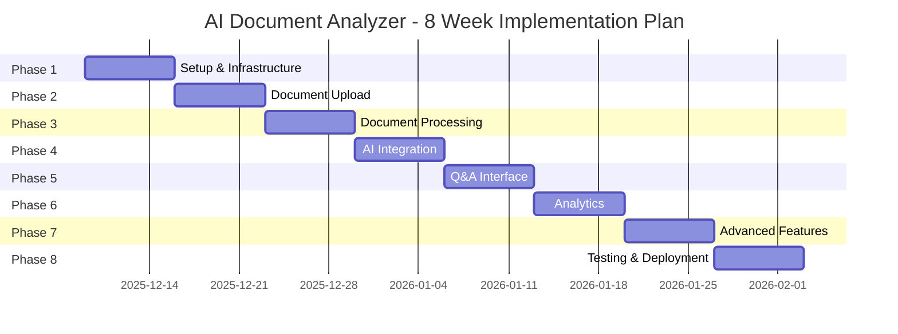

# Implementation Plan
## AI-Powered Document Analyzer

## Project Timeline Overview



---

## Phase 1: Project Setup & Core Infrastructure
**Duration**: Week 1 (Dec 9-15, 2025)  
**Goal**: Establish development environment and authentication system

### Tasks

#### 1.1 Project Structure Setup
- [x] Create monorepo structure
  ```
  project-root/
  ├── frontend/          # React application
  ├── backend/           # FastAPI application
  ├── docker/            # Docker configurations
  ├── docs/              # Documentation
  └── scripts/           # Utility scripts
  ```
- [x] Initialize Git repository
- [x] Set up .gitignore files
- [ ] Create README.md with setup instructions

#### 1.2 Frontend Setup
- [x] Initialize Vite + React + TypeScript project
- [x] Install core dependencies
  - React Router
  - Tailwind CSS + shadcn/ui
  - Zustand for state management
  - TanStack Query
  - Axios
- [x] Configure Tailwind CSS
- [x] Set up folder structure
  ```
  frontend/src/
  ├── components/        # Reusable components
  ├── pages/             # Page components
  ├── hooks/             # Custom hooks
  ├── services/          # API services
  ├── store/             # State management
  ├── types/             # TypeScript types
  └── utils/             # Utilities
  ```
- [x] Create base layout component
- [x] Set up routing structure

#### 1.3 Backend Setup
- [x] Initialize FastAPI project
- [x] Set up virtual environment
- [x] Install core dependencies
  - FastAPI, Uvicorn
  - SQLAlchemy, Alembic
  - Pydantic Settings
  - python-jose, passlib
- [x] Create folder structure
  ```
  backend/
  ├── app/
  │   ├── api/           # API routes
  │   ├── core/          # Core configurations
  │   ├── models/        # Database models
  │   ├── schemas/       # Pydantic schemas
  │   ├── services/      # Business logic
  │   └── utils/         # Utilities
  ├── alembic/           # Migrations
  ├── tests/             # Test files
  └── requirements.txt
  ```
- [x] Configure environment variables (.env)
- [ ] Set up logging configuration

#### 1.4 Database & Docker Setup
- [x] Create docker-compose.yml
  - PostgreSQL service
  - Redis service
  - Backend service (running locally)
  - Frontend service (dev, running locally)
- [x] Configure PostgreSQL connection
- [x] Set up Alembic for migrations
- [ ] Create initial database models (User, ~~Document~~)
  - User model created ✓
  - Document model pending
- [x] Run initial migration

#### 1.5 Authentication System
- [x] Create User model and schema
- [x] Implement JWT token generation
- [x] Build registration endpoint
- [x] Build login endpoint
- [ ] Implement token refresh mechanism
- [x] Add password hashing with bcrypt
- [x] Create authentication middleware
- [x] Build protected route decorator

#### 1.6 Frontend Auth Integration
- [x] Create auth store (Zustand)
- [x] Build login page UI
- [x] Build registration page UI
- [x] Implement auth service functions
- [x] Add JWT token storage (localStorage)
- [x] Create protected route component
- [x] Add axios interceptors for auth headers

### Deliverables
- ✅ Fully configured development environment
- ✅ Docker Compose with all services running
- ✅ Working authentication flow (register/login)
- ✅ Database with migrations
- ✅ Basic frontend with routing

### Success Criteria
- User can register a new account
- User can log in and receive JWT token
- Protected routes require authentication
- Docker services start without errors

---

## Phase 2: Document Upload & Storage
**Duration**: Week 2 (Dec 16-22, 2025)  
**Goal**: Implement file upload system with multi-format support

### Tasks

#### 2.1 Backend - Storage Configuration
- [ ] Set up S3/MinIO connection
- [ ] Create storage service abstraction
- [ ] Implement file upload to object storage
- [ ] Add file size validation
- [ ] Create file type validation (PDF, DOCX, XLSX, images)
- [ ] Generate unique file identifiers
- [ ] Implement file deletion functionality

#### 2.2 Backend - Document API
- [ ] Create Document model
  - id, user_id, filename, file_path, file_type
  - file_size, upload_date, status, metadata
- [ ] Create document schemas (Pydantic)
- [ ] Build POST /api/documents/upload endpoint
- [ ] Build GET /api/documents/ endpoint (list)
- [ ] Build GET /api/documents/{id} endpoint
- [ ] Build DELETE /api/documents/{id} endpoint
- [ ] Add pagination for document list
- [ ] Implement file download endpoint

#### 2.3 Frontend - Upload UI
- [ ] Create upload page component
- [ ] Integrate react-dropzone
- [ ] Build drag-and-drop zone
- [ ] Add file type icons
- [ ] Show upload progress bar
- [ ] Display file validation errors
- [ ] Create file preview component
- [ ] Add multi-file upload support

#### 2.4 Frontend - Document Management
- [ ] Create documents list page
- [ ] Build document card component
- [ ] Add document metadata display
- [ ] Implement delete confirmation modal
- [ ] Add search/filter functionality
- [ ] Create document detail view
- [ ] Add loading states and skeletons

#### 2.5 Virus Scanning (Optional)
- [ ] Integrate ClamAV or similar
- [ ] Add virus scan before storage
- [ ] Handle infected files

### Deliverables
- ✅ Working file upload system
- ✅ Document storage in S3/MinIO
- ✅ Document list and detail views
- ✅ File validation and error handling

### Success Criteria
- User can upload PDF, DOCX, XLSX files
- Files are stored securely
- User can view list of uploaded documents
- User can delete their documents
- File size limits are enforced

---

## Phase 3: Document Processing & Extraction
**Duration**: Week 3 (Dec 23-29, 2025)  
**Goal**: Extract text content from various document formats

### Tasks

#### 3.1 Celery Setup
- [ ] Install Celery and Redis
- [ ] Configure Celery worker
- [ ] Set up task routing
- [ ] Create base task classes
- [ ] Add task retry logic
- [ ] Set up Flower for monitoring

#### 3.2 Document Parsers
- [ ] Create PDF text extractor (PyPDF2 + pdfplumber)
- [ ] Create Word document parser (python-docx)
- [ ] Create Excel parser (openpyxl)
- [ ] Create image OCR (pytesseract)
- [ ] Implement text cleaning utilities
- [ ] Add language detection
- [ ] Handle parsing errors gracefully

#### 3.3 Text Processing
- [ ] Implement text chunking strategy
  - Chunk size: 1000 tokens
  - Overlap: 200 tokens
- [ ] Create metadata extraction
  - Title, author, page numbers
  - Creation date, keywords
- [ ] Add text normalization
- [ ] Implement content structure detection

#### 3.4 Async Processing Pipeline
- [ ] Create document processing task
- [ ] Add task status tracking
- [ ] Store extracted text in database
- [ ] Create DocumentChunk model
- [ ] Update document status on completion
- [ ] Implement progress notifications

#### 3.5 Frontend - Processing Status
- [ ] Add processing status indicator
- [ ] Create progress notification system
- [ ] Build document preview component
- [ ] Show extracted text preview
- [ ] Display processing errors

#### 3.6 WebSocket Integration
- [ ] Set up WebSocket endpoint
- [ ] Implement real-time status updates
- [ ] Create frontend WebSocket client
- [ ] Handle connection lifecycle
- [ ] Add reconnection logic

### Deliverables
- ✅ Multi-format document parsing
- ✅ Asynchronous processing with Celery
- ✅ Text extraction and chunking
- ✅ Real-time processing updates

### Success Criteria
- PDFs are parsed and text extracted
- Word and Excel files are processed
- Text is chunked appropriately
- User receives real-time processing updates
- Processing errors are logged and displayed

---

## Phase 4: AI Integration & Embeddings
**Duration**: Week 4 (Dec 30, 2025 - Jan 5, 2026)  
**Goal**: Integrate AI capabilities for semantic search

### Tasks

#### 4.1 OpenAI Setup
- [ ] Configure OpenAI API client
- [ ] Set up API key management
- [ ] Implement rate limiting
- [ ] Add error handling and retries
- [ ] Create cost tracking

#### 4.2 Embedding Generation
- [ ] Create embedding service
- [ ] Implement text-embedding-3-large integration
- [ ] Generate embeddings for document chunks
- [ ] Add batch embedding generation
- [ ] Store embedding metadata

#### 4.3 Vector Database Setup
- [ ] Set up Pinecone account and index
- [ ] Configure Pinecone client
- [ ] Create vector upsert functionality
- [ ] Implement vector deletion
- [ ] Add metadata filtering

#### 4.4 Indexing Pipeline
- [ ] Create document indexing task
- [ ] Generate embeddings for all chunks
- [ ] Upsert vectors to Pinecone
- [ ] Add index status tracking
- [ ] Implement batch indexing
- [ ] Handle indexing failures

#### 4.5 Semantic Search
- [ ] Create search service
- [ ] Implement query embedding
- [ ] Build similarity search function
- [ ] Add relevance scoring
- [ ] Implement result ranking
- [ ] Create search result schema

#### 4.6 RAG Implementation
- [ ] Set up LangChain
- [ ] Create RAG chain
- [ ] Implement context retrieval
- [ ] Build prompt templates
- [ ] Add source attribution
- [ ] Implement streaming responses

### Deliverables
- ✅ Vector embeddings for all documents
- ✅ Pinecone index with document vectors
- ✅ Semantic search functionality
- ✅ RAG pipeline for Q&A

### Success Criteria
- Documents are automatically indexed
- Semantic search returns relevant results
- RAG pipeline generates accurate answers
- Sources are properly cited
- API responses are fast (<3 seconds)

---

## Phase 5: Q&A Interface & Chat
**Duration**: Week 5 (Jan 6-12, 2026)  
**Goal**: Build interactive chat interface for document Q&A

### Tasks

#### 5.1 Backend - Chat API
- [ ] Create Conversation model
- [ ] Create Message model
- [ ] Build POST /api/chat/query endpoint
- [ ] Implement streaming response
- [ ] Add conversation history management
- [ ] Create context window management
- [ ] Implement multi-document querying

#### 5.2 Chat Service
- [ ] Create chat service class
- [ ] Implement query processing
- [ ] Add conversation context
- [ ] Build response generation
- [ ] Implement citation extraction
- [ ] Add confidence scoring

#### 5.3 Frontend - Chat UI
- [ ] Create chat page component
- [ ] Build message list component
- [ ] Create message input component
- [ ] Add typing indicator
- [ ] Implement auto-scroll
- [ ] Display citations inline
- [ ] Add copy message functionality

#### 5.4 Real-time Chat
- [ ] Set up Socket.io server
- [ ] Create chat WebSocket handlers
- [ ] Implement message streaming
- [ ] Add typing indicators
- [ ] Handle connection drops
- [ ] Implement message queue

#### 5.5 Conversation Management
- [ ] Create conversation list view
- [ ] Add new conversation button
- [ ] Implement conversation deletion
- [ ] Add conversation export (JSON/PDF)
- [ ] Create conversation search
- [ ] Implement conversation sharing

#### 5.6 Source Display
- [ ] Create source card component
- [ ] Add document preview modal
- [ ] Highlight relevant text
- [ ] Show page numbers
- [ ] Add "view in document" link

### Deliverables
- ✅ Interactive chat interface
- ✅ Real-time message streaming
- ✅ Conversation history
- ✅ Source attribution display

### Success Criteria
- User can ask questions about documents
- Responses stream in real-time
- Sources are clearly displayed
- Conversations are persisted
- Multi-document queries work correctly

---

## Phase 6: Analytics & Insights
**Duration**: Week 6 (Jan 13-19, 2026)  
**Goal**: Generate insights and analytics from documents

### Tasks

#### 6.1 Document Summarization
- [ ] Create summarization service
- [ ] Implement full document summary
- [ ] Add extractive summarization
- [ ] Create abstractive summarization
- [ ] Add multi-language support
- [ ] Build summary API endpoint

#### 6.2 Key Insights Extraction
- [ ] Implement key points extraction
- [ ] Add topic detection
- [ ] Create main themes identification
- [ ] Extract action items
- [ ] Identify important dates/numbers
- [ ] Build insights API

#### 6.3 Entity Recognition
- [ ] Integrate NER (Named Entity Recognition)
- [ ] Extract people, organizations, locations
- [ ] Identify dates, monetary values
- [ ] Create entity relationship mapping
- [ ] Add entity filtering

#### 6.4 Sentiment Analysis
- [ ] Implement sentiment detection
- [ ] Add emotion analysis
- [ ] Create sentiment scoring
- [ ] Build sentiment visualization
- [ ] Add sentiment trends

#### 6.5 Analytics Dashboard
- [ ] Create dashboard page
- [ ] Build summary card components
- [ ] Add insights list component
- [ ] Create entity visualization
- [ ] Implement sentiment charts
- [ ] Add document statistics
- [ ] Create word cloud component

#### 6.6 Report Generation
- [ ] Create report service
- [ ] Build PDF report generation
- [ ] Add Excel export
- [ ] Create report templates
- [ ] Implement custom reports
- [ ] Add scheduled reports

### Deliverables
- ✅ Document summarization
- ✅ Key insights extraction
- ✅ Analytics dashboard
- ✅ Exportable reports

### Success Criteria
- Summaries are accurate and concise
- Key insights are relevant
- Dashboard displays meaningful metrics
- Reports can be exported in multiple formats
- Analytics load quickly

---

## Phase 7: Advanced Features
**Duration**: Week 7 (Jan 20-26, 2026)  
**Goal**: Implement advanced functionality and optimizations

### Tasks

#### 7.1 Document Comparison
- [ ] Create comparison service
- [ ] Implement diff algorithm
- [ ] Build side-by-side comparison UI
- [ ] Add change highlighting
- [ ] Create comparison report

#### 7.2 Batch Processing
- [ ] Implement bulk upload
- [ ] Add batch processing queue
- [ ] Create batch status tracking
- [ ] Build batch results view
- [ ] Add batch export

#### 7.3 Custom Prompts
- [ ] Create prompt template system
- [ ] Build prompt editor UI
- [ ] Add prompt variables
- [ ] Implement prompt library
- [ ] Add prompt sharing

#### 7.4 User Settings
- [ ] Create settings page
- [ ] Add theme customization
- [ ] Implement notification preferences
- [ ] Add API key management
- [ ] Create usage statistics view

#### 7.5 Collaboration
- [ ] Implement document sharing
- [ ] Add share link generation
- [ ] Create access control (view/edit)
- [ ] Build shared documents view
- [ ] Add collaboration notifications

#### 7.6 Performance Optimization
- [ ] Implement response caching
- [ ] Add database query optimization
- [ ] Create API result pagination
- [ ] Implement lazy loading
- [ ] Add CDN for static assets
- [ ] Optimize bundle size

### Deliverables
- ✅ Document comparison tool
- ✅ Batch processing capability
- ✅ Custom prompt templates
- ✅ Document sharing features

### Success Criteria
- Documents can be compared side-by-side
- Batch operations handle 100+ files
- Custom prompts improve results
- Sharing works with proper access control
- Application feels fast and responsive

---

## Phase 8: Testing, Optimization & Deployment
**Duration**: Week 8 (Jan 27 - Feb 2, 2026)  
**Goal**: Ensure quality and deploy to production

### Tasks

#### 8.1 Backend Testing
- [ ] Write unit tests for services
- [ ] Create API integration tests
- [ ] Add database test fixtures
- [ ] Test authentication flows
- [ ] Test file upload edge cases
- [ ] Test AI service integration
- [ ] Achieve 80%+ code coverage

#### 8.2 Frontend Testing
- [ ] Write component tests
- [ ] Create E2E tests (Playwright)
- [ ] Test responsive design
- [ ] Test browser compatibility
- [ ] Test accessibility (WCAG)
- [ ] Perform usability testing

#### 8.3 Performance Testing
- [ ] Load test API endpoints
- [ ] Test concurrent uploads
- [ ] Measure response times
- [ ] Test database performance
- [ ] Profile memory usage
- [ ] Optimize bottlenecks

#### 8.4 Security Audit
- [ ] Review authentication security
- [ ] Test authorization logic
- [ ] Scan for vulnerabilities (OWASP)
- [ ] Test input validation
- [ ] Review file upload security
- [ ] Check API rate limiting

#### 8.5 Documentation
- [ ] Write API documentation
- [ ] Create user guide
- [ ] Document deployment process
- [ ] Add troubleshooting guide
- [ ] Create development guide
- [ ] Write architecture documentation

#### 8.6 CI/CD Setup
- [ ] Create GitHub Actions workflow
- [ ] Add automated testing
- [ ] Set up linting checks
- [ ] Configure deployment pipeline
- [ ] Add environment management
- [ ] Set up secrets management

#### 8.7 Production Deployment
- [ ] Set up production infrastructure
  - Cloud VMs or container service
  - Managed PostgreSQL
  - Managed Redis
  - S3/Blob storage
  - Load balancer
  - SSL certificates
- [ ] Configure environment variables
- [ ] Run database migrations
- [ ] Deploy backend services
- [ ] Deploy frontend (CDN)
- [ ] Configure domain and DNS
- [ ] Set up monitoring and alerts

#### 8.8 Post-Deployment
- [ ] Monitor error rates
- [ ] Check performance metrics
- [ ] Verify all features work
- [ ] Test production backups
- [ ] Create runbook for operations
- [ ] Train support team

### Deliverables
- ✅ Comprehensive test suite
- ✅ CI/CD pipeline
- ✅ Production deployment
- ✅ Complete documentation
- ✅ Monitoring and alerting

### Success Criteria
- All tests pass (unit, integration, E2E)
- Code coverage >80%
- No critical security issues
- Application deployed to production
- Monitoring shows healthy metrics
- Documentation is complete and accurate

---

## Risk Management

### Technical Risks

| Risk | Impact | Probability | Mitigation |
|------|--------|-------------|------------|
| OpenAI API rate limits | High | Medium | Implement caching, request queuing |
| Large file processing timeout | Medium | High | Async processing, progress tracking |
| Vector DB cost overrun | High | Medium | Optimize embedding storage, use batching |
| Authentication vulnerabilities | Critical | Low | Security audit, follow best practices |
| Database performance issues | Medium | Medium | Indexing, query optimization, caching |

### Schedule Risks

| Risk | Impact | Probability | Mitigation |
|------|--------|-------------|------------|
| Underestimated complexity | Medium | Medium | Buffer time in schedule, prioritize MVP |
| Third-party API changes | Medium | Low | Monitor changelogs, use versioned APIs |
| Testing takes longer | Low | High | Start testing early, parallel testing |

---

## Quality Assurance Checklist

### Code Quality
- [ ] All code follows style guide
- [ ] No ESLint/Ruff warnings
- [ ] Type checking passes (TypeScript, mypy)
- [ ] Code reviews completed
- [ ] No hardcoded secrets

### Testing
- [ ] Unit tests written and passing
- [ ] Integration tests passing
- [ ] E2E tests covering critical paths
- [ ] Load tests completed
- [ ] Security tests passed

### Documentation
- [ ] API documentation complete
- [ ] README with setup instructions
- [ ] Code comments for complex logic
- [ ] Deployment guide written
- [ ] User guide available

### Performance
- [ ] Page load time <3 seconds
- [ ] API response time <2 seconds
- [ ] Time to interactive <5 seconds
- [ ] Lighthouse score >90

### Security
- [ ] HTTPS enforced
- [ ] Authentication tested
- [ ] Authorization tested
- [ ] Input validation implemented
- [ ] Rate limiting active
- [ ] CORS configured correctly

---

## Post-Launch Roadmap

### Month 2-3
- Collect user feedback
- Fix bugs and issues
- Optimize performance
- Add minor features
- Improve documentation

### Month 4-6
- Multi-language support
- Advanced analytics
- API for third-party integrations
- Mobile app (React Native)
- Custom model fine-tuning

### Month 7-12
- Multi-tenancy for organizations
- Advanced collaboration features
- Marketplace for prompt templates
- Enterprise features (SSO, audit logs)
- On-premise deployment option

---

## Success Metrics

### Technical Metrics
- **Uptime**: 99.9%
- **Response Time**: <2s (p95)
- **Error Rate**: <0.1%
- **Test Coverage**: >80%

### Business Metrics
- **User Registration**: 100+ users in first month
- **Document Uploads**: 1000+ documents
- **Active Users**: 50% weekly retention
- **NPS Score**: >50

### User Satisfaction
- **Average Session Duration**: >10 minutes
- **Feature Adoption**: 70% use Q&A feature
- **Support Tickets**: <5 per week
- **User Reviews**: 4+ stars average

---

## Team & Resources

### Required Roles
- **Full-stack Developer**: 1-2 people
- **DevOps Engineer**: 0.5 (part-time)
- **UI/UX Designer**: 0.5 (part-time)
- **QA Tester**: 0.5 (part-time)

### Infrastructure Costs
- **Development**: ~$0-50/month
- **Production**: ~$280-740/month
- **Buffer**: 20% for unexpected costs

---

## Communication Plan

### Daily
- Stand-up updates (async)
- Blocker identification

### Weekly
- Sprint planning
- Demo completed features
- Retrospective

### Milestones
- Phase completion reviews
- Stakeholder demos
- Go/No-go decisions

---

## Definition of Done

A feature is considered "done" when:
- [ ] Code is written and committed
- [ ] Unit tests written and passing
- [ ] Integration tests passing
- [ ] Code reviewed and approved
- [ ] Documentation updated
- [ ] Merged to main branch
- [ ] Deployed to staging
- [ ] Tested in staging environment
- [ ] Approved by stakeholders
- [ ] Deployed to production

---

## Conclusion

This implementation plan provides a structured approach to building the AI-Powered Document Analyzer over 8 weeks. Each phase builds upon the previous one, ensuring a solid foundation while progressively adding features. Regular testing, documentation, and quality checks throughout the process will lead to a production-ready application.

**Next Steps:**
1. Review and approve this plan
2. Set up project tracking (Jira, Linear, GitHub Projects)
3. Begin Phase 1: Project Setup
4. Schedule weekly check-ins
5. Start building! 🚀
